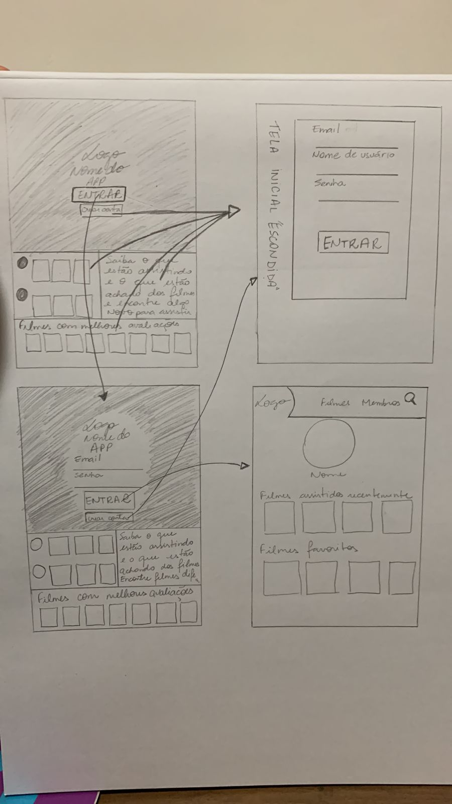
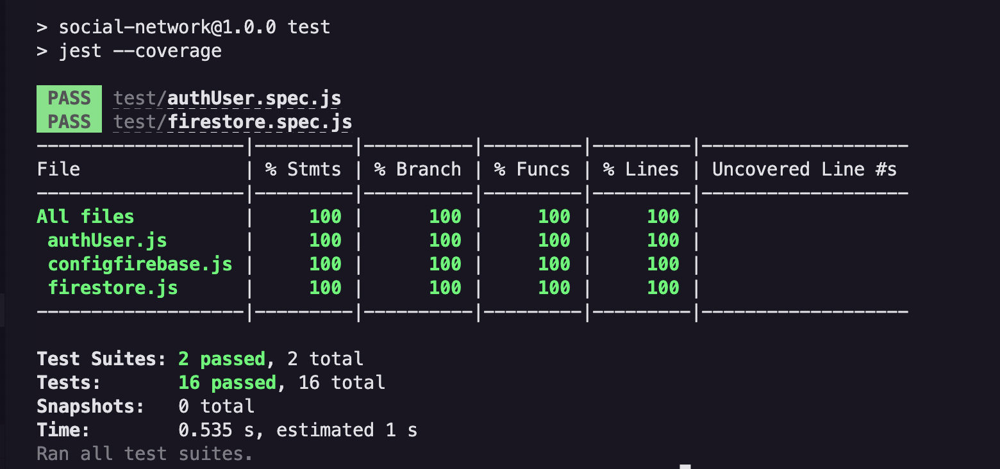

# Social Network - Readme 

## 
**Acesse o projeto:**

**Tecnologias utilizadas**

     

## Índice

* [Resumo do projeto](#resumo-do-projeto)
* [Protótipos](#protótipos)
* [Histórias de usuário](#histórias-de-usuário)
* [Testes de Usabilidade](#testes-de-usabilidade)
* [Objetivos de aprendizagem alcançados](#objetivos-de-aprendizagem-alcançados)
* [Testes Unitários](#testes-unitários)
* [Considerações gerais](#considerações-gerais)
* [Desenvolvedoras](#desenvolvedoras)

***

## Resumo do projeto

Neste projeto construimos uma _rede social_ sobre filmes e séries onde o usuário pode acessar e interagir com outras pessoas. Ao acessar, é possivel criar uma conta, realizar login, acessar o feed com publicações de outros usuários, curtir e/ou descurtir posts, além de criar novos posts sobre o tema.
O público alvo dessa rede social são críticos de cinema, cinéfilos e pessoas que tem como hobby assistir filmes e séries. Buscamos preparar um ambiente onde o usuário possa se conectar com outras pessoas, trocar ideias e ver o que está em alta nos debates e nas telas.

## Protótipos 

**Baixa fidelidade**

###
**Alta fidelidade - Mobile**

**Alta fidelidade - Web**

## Histórias de usuário

Perfis dos usuários:

Usuário 1: Eu como fã de filmes e séries, gostaria de criar uma conta no App para poder ver o que as pessoas estão curtindo assistir.

Usuário 2: Como fã de filmes e séries, tendo uma conta válida no App, quero poder ler comentários de outros usuários para poder escolher melhor o filme que irei ou não assistir.

Usuário 3: Sou um cinéfilo e curto a ideia de fazer pequenas críticas sobre os filmes que assisto. Já tendo uma conta válida no App e quero poder postar comentários no feed para que outros usuários vejam. Também deleto o comentário que fiz, quando for necessário.

Usuário 4: Faço pequenas críticas sobre os filmes que assisto e compartilho comentários na rede social. Além de postar comentários no feed, também edito e deleto quando é necessário. Sempre curto os comentários de outros usuários que chamam mais minha atenção.

## Testes de Usabilidade

Comentários sobre o conteúdo, diagramação e funcionalidades:

+ *Acessado por navegador, gostei do uso de cores. Gostei da uniformidade arredondada de toda a rede social. Bem intuitivo. Tive acesso facilmente a informação sem problemas no uso.*

+ *Acessado por celular e navegador. Observei que ainda não há uma página de perfil completa, mas o feed está ótimo e é muito divertido ver os comentários. Sugiro uma busca por nome de filme entre os posts em atualizações futuras do aplicativo.*

+ *Acessado por celular, a responsividade do feed está ótima. É um app fácil de ser usado e com um tema super legal. Seria bom poder usar tags e hashtags para marcar os temas e poder comentar um post específico. Consegui dar like em tudo que gostei.*

## Objetivos de aprendizagem alcançados

- HTML
    - Uso de HTML semântico
###
- CSS
    - Uso de seletores de CSS
    - Modelo de caixa (box model): borda, margem, preenchimento
    - Uso de flexbox em CSS
    - Uso de CSS Grid Layout
###
  - Web APIs
    - Uso de seletores de DOM
    - Manipulação de eventos de DOM (listeners, propagação, delegação)
    - Manipulação dinâmica de DOM
    - Routing (History API, evento hashchange, window.location)
###
  - JavaScript
    - Arrays (arranjos)
    - Objetos (key, value)
    - Diferenciar entre tipos de dados primitivos e não primitivos
    - Variáveis (declaração, atribuição, escopo)
    - Uso de condicionais (if-else, switch, operador ternário, lógica booleana)
    - Uso de laços (while, for, for..of)
    - Funções (params, args, return)
    - Testes unitários (unit tests)
    - Testes assíncronos
    - Uso de mocks e espiões
    - Módulos de ECMAScript (ES modules)
    - Uso de linter (ESLINT)
    - Uso de identificadores descritivos (Nomenclatura e Semântica)
    - Diferença entre expressões (expressions) e declarações (statements)
    - Callbacks
    - Promessas
###
  - Controle de Versões (Git e GitHub)

  - Centrado no usuário
  
  - Design de produto

  - Pesquisa

  - Firebase

  - Firestore

## Testes Unitários

**Realização dos Testes**

Foram realizados os testes unitários, com mock do firestore e do firebase.

## Considerações gerais

No projeto da Rede Social, que chamamos de Contraplano, o usuário pode criar uma conta de acesso, logar-se com ela, criar, editar, deletar e dar _likes_ em publicações.
No desenvolvimento para esse projeto, focamos em [Single-page
Application
(SPA)](https://pt.wikipedia.org/wiki/Aplicativo_de_p%C3%A1gina_%C3%BAnica)
_responsiva_ (com mais de uma tela/página e adaptado para web e mobile) na
qual é possível ler e escrever dados em forma de posts(comentários). 
Para configurar a criação de login e autenticação do usuário e base de dados dos posts nós utilizamos o [Firebase](https://firebase.google.com/docs/auth?hl=pt-br) e o [Firestore](https://firebase.google.com/docs/firestore?hl=pt-br).
Conseguimos implementar as funcionalidades para atender as demandas dos usuários e atingir os objetivos de aprendizagem.

** Projeto entregue através do GitHub
  [Projeto Rede Social](https://pages.github.com/)

  ** Readme de orientação para projeto
  [Laboratoria - Social Network](https://github.com/Laboratoria/SAP010-social-network)

## Desenvolvedoras

Projeto desenvolvido por [Larissa Velace](https://github.com/LariVelace/), [Maila Ferreira](https://github.com/MailaFAP)  e [Vitória Victor](https://github.com/vitoriavictor)

###
###